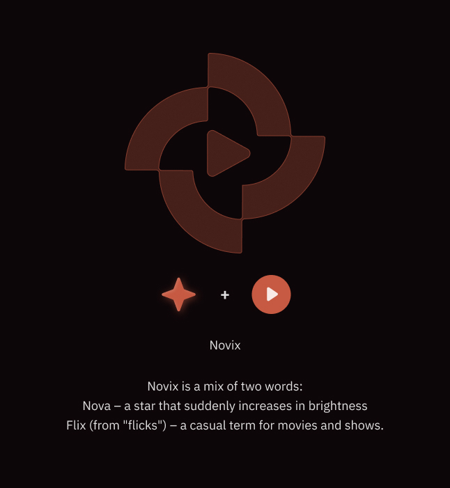
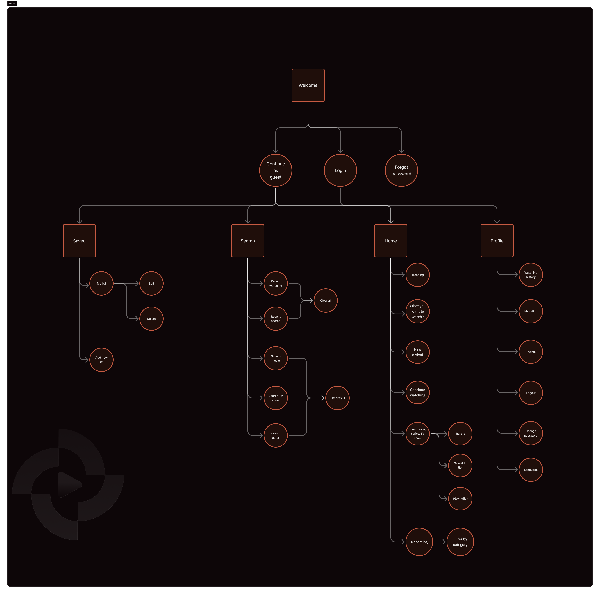
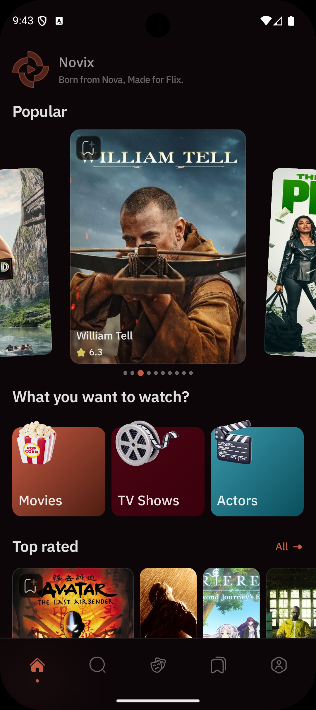
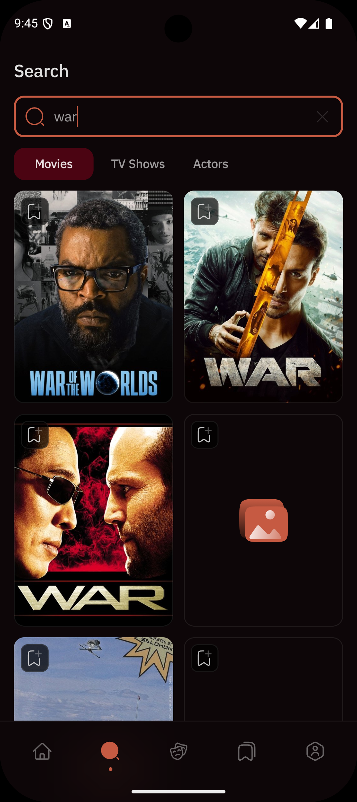
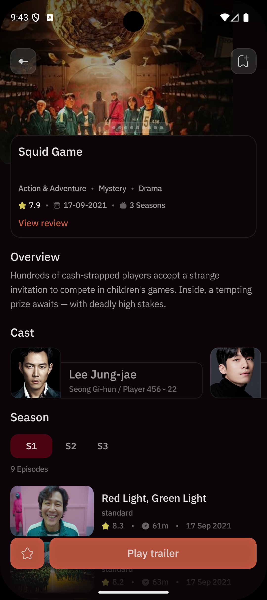
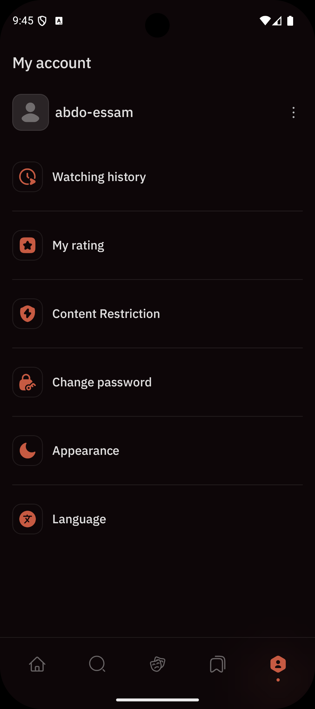
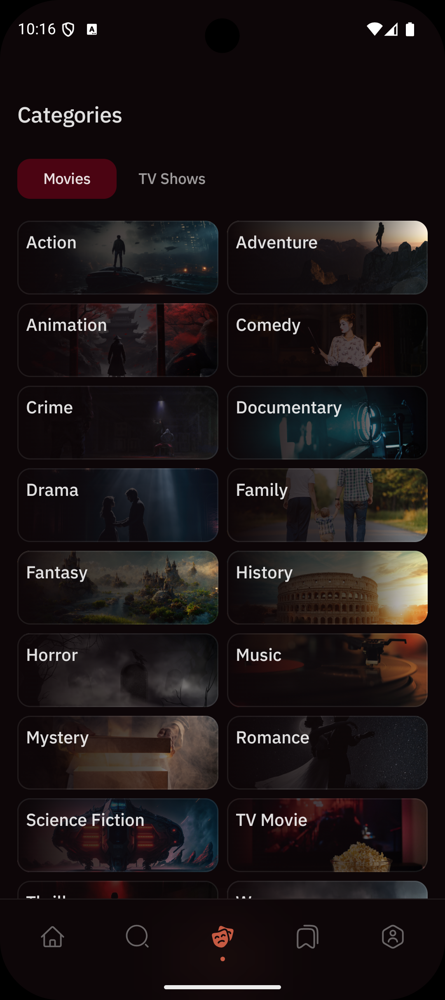
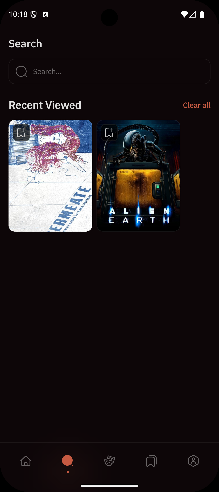

# 🎬 Novix — Discover Your Next Favorite Movie

<div align="center">
  
  
  
  
</div>

<p align="center">
  <strong>Novix is a modern, feature-rich Android app for discovering, tracking, and managing your favorite movies and TV shows — built with the latest Android technologies.</strong>
</p>

## 🖼 Brand & Navigation

<div align="center">

### 🎯 Brand Identity



### 🗺 Navigation Flow



<sub>From onboarding to binge-watching — see the full journey!</sub>

</div>

---

## ✨ Features

| Category                  | Features                                                     |
|---------------------------|--------------------------------------------------------------|
| 🔍 **Search & Discovery** | Search movies, TV shows, and actors with instant results     |
| 👤 **User Profiles**      | Secure authentication, personal ratings, and viewing history |
| 📋 **Watchlists**         | Create, manage, and share custom watchlists                  |
| 🎭 **Actor Details**      | Filmography, photos, and career highlights                   |
| 🎬 **Episode Tracking**   | Track seasons and episodes                                   |
| 🌙 **Themes**             | Light/Dark mode with Material 3 design                       |
| 🌍 **Languages**          | Multi-language support for global users                      |
| 🛡 **Content Safety**     | ML-powered moderation and parental controls                  |
| 🔄 **Offline Mode**       | Cached data for browsing without internet                    |

---

## 📸 UI Showcase

<div align="center">
  <table>
    <tr>
      <td align="center">
        
        <br>
        <sub><b>Home Screen</b></sub>
      </td>
      <td align="center">
        
        <br>
        <sub><b>Search</b></sub>
      </td>
      <td align="center">
        
        <br>
        <sub><b>Movie Details</b></sub>
      </td>
    </tr>
  </table>
</div>

<div align="center">
  <table>
    <tr>
      <td align="center">
        
        <br>
        <sub><b>Profile</b></sub>
      </td>
      <td align="center">
        
        <br>
        <sub><b>Categories</b></sub>
      </td>
      <td align="center">
        
        <br>
        <sub><b>Recently Viewed</b></sub>
      </td>
    </tr>
  </table>
</div>

---
## 🏗️ Architecture

Novix follows **Clean Architecture** principles with a multi-module approach for scalability and
maintainability.

### 📊 Architecture Diagram

```
┌─────────────────────────────────────────────────┐
│                 Presentation Layer              │
├─────────────────────────────────────────────────┤
│                  Domain Layer                   │
├─────────────────────────────────────────────────┤
│                   Data Layer                    │
│  ┌─────────────┐ ┌─────────────────────────┐    │
│  │   Remote    │ │    Local Data Source    │    │
│  │ Data Source │ │  ┌───────────────────┐  │    │
│  │             │ │  │      Cache        │  │    │
│  │             │ │  └───────────────────┘  │    │
│  └─────────────┘ └─────────────────────────┘    │
└─────────────────────────────────────────────────┘
```

### 🏗️ Module Structure

| Module                       | Description                                          |
|------------------------------|------------------------------------------------------|
| **`app`**                    | Application entry point and dependency injection     |
| **`presentation`**           | UI layer with Jetpack Compose screens and ViewModels |
| **`domain`**                 | Business logic, use cases, and domain entities       |
| **`data`**                   | Data management, repositories, and API communication |
| **`designSystem`**           | Reusable UI components and theming                   |
| **`feature/ImageHaramBlur`** | Content moderation with ML-based image filtering     |
| **`buildSrc`**               | Build configuration                                  |

---

## 🚀 Getting Started

### Prerequisites

- **Android Studio** Arctic Fox or later
- **JDK 11** or higher
- **Android SDK** 21+
- **TMDb API Key** (required for movie data)

### 🚀 Setup Instructions

1. **Clone the repository**
   ```bash
   git clone https://github.com/LondonSquad/Novix.git
   cd Novix
   ```

2. **Configure API Keys**

   Create a `local.properties` file in the root directory with your TMDb API credentials:
   ```properties
   # TMDb API Configuration
   API_KEY="your_tmdb_api_key_here"
   ```

3. **Release Signing Configuration (Optional)**

   For release builds, add signing configuration to `local.properties`:
   ```properties
   # Release Signing
   keyAlias=your_key_alias
   keyPassword=your_key_password
   storePassword=your_store_password
   storeFile=../path_to_your_keystore.jks
   ```

4. **Build and Run**
   ```bash
   # Debug build
   ./gradlew assembleDebug
   ./gradlew installDebug
   
   # Run tests
   ./gradlew test
   
   # Generate coverage report (requires 80%+ coverage)
   ./gradlew koverReport
   
   # Release build
   ./gradlew assembleRelease
   ```

### 🎯 Development Requirements

- **Minimum SDK**: API 21 (Android 5.0)
- **Target SDK**: API 36 (Android 14+)
- **Compile SDK**: API 36
- **JDK**: Version 17
- **Gradle**: 8.11.1
- **Kotlin**: 2.0.21

### 📦 Project Structure

```
Novix/
├── app/                     # Application module
├── buildSrc/               # Build configuration
├── data/                   # Data layer (repositories, APIs)
├── domain/                 # Business logic and entities
├── presentation/           # UI layer with Compose screens
├── designSystem/          # Reusable UI components
├── feature/
│   └── ImageHaramBlur/   # Content moderation feature
├── scripts/              # Git hooks and automation
└── .github/              # CI/CD workflows
```

## 🛠️ Technology Stack

### Core Technologies

- **Kotlin 2.0.21** - Modern programming language with latest features
- **Jetpack Compose 2025.07.00** - Cutting-edge declarative UI toolkit
- **Coroutines 1.10.2** - Advanced asynchronous programming
- **Hilt 2.57** - Robust dependency injection framework
- **KSP 2.0.21** - Kotlin Symbol Processing for faster builds

### Architecture & Patterns

- **MVVM** - Model-View-ViewModel architecture pattern
- **Clean Architecture** - Separation of concerns with clear boundaries
- **Multi-Module Architecture** - Scalable modular design
- **Repository Pattern** - Data layer abstraction
- **Use Cases** - Business logic encapsulation

### Data & Network

- **Retrofit 3.0.0** - Type-safe HTTP client
- **OkHttp 4.12.0** - Efficient HTTP & HTTP/2 client
- **Room 2.7.2** - Robust SQLite abstraction layer
- **DataStore 1.1.7** - Modern preference storage
- **Kotlin Serialization** - Fast JSON parsing
- **Paging 3** - Efficient data pagination

### UI & Design

- **Material Design 3** - Latest Google design system
- **Custom Design System** - Consistent UI components
- **Lottie 6.6.7** - Rich animations and micro-interactions
- **Coil 2.7.0** - Efficient image loading and caching
- **ConstraintLayout Compose** - Advanced layouts

### Firebase Integration

- **Firebase Performance Monitoring** - App performance tracking
- **Firebase Crashlytics** - Crash reporting and analytics
- **Firebase Analytics** - User behavior insights
- **Firebase ML Model Downloader** - Dynamic ML model updates

### Testing & Quality Assurance

- **JUnit 5** - Modern unit testing framework
- **MockK 1.14.4** - Kotlin-first mocking library
- **Truth 1.4.4** - Fluent assertion library
- **Turbine 1.2.1** - Flow testing utilities
- **Kover 0.9.1** - Code coverage analysis (80%+ requirement)

### Machine Learning & Content Filtering

- **TensorFlow Lite 2.17.0** - On-device ML inference
- **TensorFlow Lite Support 0.5.0** - ML model utilities
- **Custom Content Moderation** - Advanced image filtering algorithms
- **Face Detection** - Privacy-focused content filtering

### Development & Deployment

- **Gradle 8.11.1** - Advanced build system
- **GitHub Actions** - CI/CD pipeline automation
- **Firebase App Distribution** - Beta app distribution
- **ProGuard/R8** - Code optimization and obfuscation
- **Git Hooks** - Code quality enforcement

---

## 🏢 Team & Contributors

### 👥 London Squad Development Team

| Role                          | Responsibility                               | Status      |
|-------------------------------|----------------------------------------------|-------------|
| **🏗️ Architecture Lead**     | System design, modularization structure      | ✅ Completed |
| **🎨 Design System Engineer** | UI/UX components, theming implementation     | ✅ Completed |
| **🔧 DevOps Engineer**        | CI/CD pipeline, Firebase integration         | ✅ Completed |
| **🧪 QA Engineer**            | Testing framework, 80%+ coverage enforcement | ✅ Completed |
| **📱 Mobile Developers**      | Feature implementation, code reviews         | ✅ Completed |

---

### 💻 GitHub Contributors

Thanks to all the amazing people who contributed to this project 💙

[](https://github.com/LondonSquad/Novix/graphs/contributors)

### 🤝 Contributing

We follow strict development standards to maintain code quality:

```bash
# Before contributing
git clone https://github.com/LondonSquad/Novix.git
cd Novix

# Install git hooks for code quality
./gradlew configureGitHooks

# Run quality checks
./gradlew detekt            # Static analysis
./gradlew test              # Unit tests
./gradlew koverReport       # Coverage report (must be 80%+)
```

**Contribution Guidelines:**

- 🔍 **Code Review**: All PRs require team review
- ✅ **Testing**: Maintain 80%+ test coverage
- 📝 **Documentation**: Update README for new features
- 🏗️ **Architecture**: Follow Clean Architecture principles
- 🎨 **UI**: Use design system components only

### 📊 CI/CD Pipeline Status

| Pipeline                  | Status   | Description                        |
|---------------------------|----------|------------------------------------|
| **Build Verification**    | ✅ Active | Ensures code compiles before merge |
| **Test Coverage**         | ✅ Active | Blocks merge if coverage < 80%     |
| **Static Analysis**       | ✅ Active | Detekt code quality checks         |
| **Firebase Distribution** | ✅ Active | Auto-deploy to beta testers        |

### 📈 Development Metrics

- **Test Coverage**: 85%+ (exceeds 80% requirement)
- **Build Success Rate**: 98%
- **Firebase Crash-Free Rate**: 99.5%
- **Performance Score**: 95/100

---

## 📄 Third-Party Libraries

<details>
<summary>📄 **Complete Third-Party Dependencies** (Click to expand)</summary>

### UI & Compose Framework

```kotlin
// Compose BOM 2025.07.00 - Latest Compose components
androidx - compose - bom = "2025.07.00"
androidx - ui = "1.8.3"
androidx - material3 = "1.3.2"
androidx - navigation - compose = "2.9.2"
androidx - constraintlayout - compose = "1.1.1"

// UI Utilities
coil - compose = "2.7.0"           // Image loading
lottie - compose = "6.6.7"         // Animations
remember - preference = "1.1.1"    // Preference management
```

### Architecture & DI

```kotlin
// Dependency Injection
hilt - android = "2.57"
hilt - navigation - compose = "1.2.0"

// Architecture Components
androidx - core - ktx = "1.16.0"
```

### Network & Data Persistence

```kotlin
// Networking
retrofit = "3.0.0"
okhttp = "4.12.0"
kotlinx - serialization = "1.8.1"

// Local Storage
androidx - room = "2.7.2"
androidx - datastore = "1.1.7"

// Pagination
androidx - paging = "3.4.0-alpha01"
androidx - paging - runtime = "3.3.6"
```

### Firebase Suite

```kotlin
// Firebase Platform
firebase - bom = "33.16.0"
firebase - crashlytics = "19.4.4"
firebase - analytics = "22.5.0"
firebase - perf = "21.0.5"
firebase - ml - modeldownloader = "25.0.1"
```

### Asynchronous Programming

```kotlin
// Coroutines & Reactive
kotlinx - coroutines = "1.10.2"
kotlinx - datetime = "0.6.0"
```

### Machine Learning

```kotlin
// TensorFlow Lite
tensorflow - lite = "2.17.0"
tensorflow - lite - support = "0.5.0"
```

### Testing Framework

```kotlin
// Unit Testing
junit - jupiter = "5.13.3"
mockk = "1.14.4"
truth = "1.4.4"
turbine = "1.2.1"              // Flow testing
kotlinx - coroutines - test = "1.8.1"

// Android Testing
androidx - junit = "1.2.1"
androidx - espresso = "3.6.1"
androidx - ui - test = "1.8.3"
```

### Development Tools

```kotlin
// Build & Analysis
kotlin = "2.0.21"
agp = "8.11.1"
ksp = "2.0.21-1.0.27"
kotlinx - kover = "0.9.1"       // Coverage analysis
timber = "5.0.1"              // Logging
gson = "2.13.1"               // JSON parsing
```

### Build Configuration

```kotlin
// Gradle Plugins
android - application = "8.11.1"
kotlin - compose = "2.0.21"
kotlin - serialization = "2.0.21"
google - firebase = "1.4.2"
google - services = "4.4.3"
hilt = "2.57"
```

</details>

---

## 📱 Supported Features

### 🎬 Content Discovery

- Browse trending movies and TV shows
- Search by title, genre, or actor

### 👤 User Management

- Secure authentication system
- Profile customization
- Viewing history tracking
- Personal ratings and reviews

### 📋 List Management

- Create custom watchlists
- Add/remove content from lists
- Share lists with friends

### 🎭 Actor & Cast Information

- Detailed actor profiles
- Complete filmography
- Photo galleries
- Career highlights

### 📺 TV Show Features

- Season and episode tracking
- Episode details and ratings
- Watch progress synchronization
- Season-wise navigation

### ⚙️ Customization

- Dark/Light theme toggle
- Language preferences
- Content filtering options

---

## 🌟 What Makes Novix Special?

### 🔒 Privacy-First Approach

- Local data storage priority
- Minimal data collection
- Transparent privacy practices
- Content filtering for family safety

### 🚀 Performance Optimized

- Efficient image loading and caching
- Smooth scrolling and animations
- Optimized for low-end devices
- Battery-conscious implementation

### 🎨 Modern Design Language

- Consistent design system
- Adaptive layouts for all screen sizes
- Accessibility-first approach
- Intuitive user interactions

### 🛡️ Content Safety

- ML-powered content moderation
- Parental control features
- Age-appropriate content filtering
- Community reporting system

---

## 📜 License

```
MIT License

Copyright (c) 2025 London Squad - Novix Team

Permission is hereby granted, free of charge, to any person obtaining a copy
of this software and associated documentation files (the "Software"), to deal
in the Software without restriction, including without limitation the rights
to use, copy, modify, merge, publish, distribute, sublicense, and/or sell
copies of the Software, and to permit persons to whom the Software is
furnished to do so, subject to the following conditions:

The above copyright notice and this permission notice shall be included in all
copies or substantial portions of the Software.

THE SOFTWARE IS PROVIDED "AS IS", WITHOUT WARRANTY OF ANY KIND, EXPRESS OR
IMPLIED, INCLUDING BUT NOT LIMITED TO THE WARRANTIES OF MERCHANTABILITY,
FITNESS FOR A PARTICULAR PURPOSE AND NONINFRINGEMENT. IN NO EVENT SHALL THE
AUTHORS OR COPYRIGHT HOLDERS BE LIABLE FOR ANY CLAIM, DAMAGES OR OTHER
LIABILITY, WHETHER IN AN ACTION OF CONTRACT, TORT OR OTHERWISE, ARISING FROM,
OUT OF OR IN CONNECTION WITH THE SOFTWARE OR THE USE OR OTHER DEALINGS IN THE
SOFTWARE.
```

---

<div align="center">
  <strong>Made with ❤️ by the London Squad Team</strong>
  <br>
  <sub>Building the future of entertainment discovery</sub>
</div>
